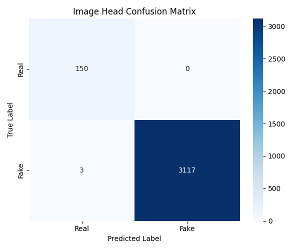
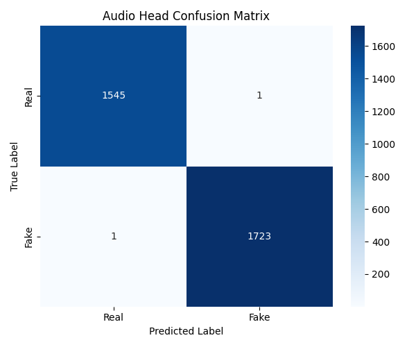

# Deepfake Detection Using Multimodal Learning

## Overview

This project implements a Multi-Task Deepfake Detection architecture capable of independently analyzing visual and audio streams to detect synthetic manipulation. As generative AI becomes increasingly sophisticated, unimodal detection systems (e.g., analyzing only images) are easily bypassed by deepfakes that manipulate the opposite modality. 

Our approach solves this by explicitly decoupling the detection pipeline into a unified multimodal network. It can pinpoint exactly whether the visual frames are manipulated, whether the audio track is synthetic, or whether both modalities have been altered, providing modality-specific predictions for the evaluated FakeAVCeleb scenarios.

## Key Features

- **Visual deepfake detection:** Uses a pre-trained visual encoder to detect spatial inconsistencies and synthetic visual artifacts.
- **Audio deepfake detection:** Analyzes Log-Mel Spectrograms through a specialized audio encoder to detect voice cloning and synthetic audio.
- **Multimodal fusion:** Fuses visual and audio embeddings to output a comprehensive final prediction.
- **Image/audio/video support:** Flexible inference accepting independent or combined modalities.
- **Grad-CAM interpretability:** Generates visual heatmaps highlighting approximate regions and frequency-time areas receiving strong attribution from the model that influenced the model's decision.
- **Streamlit demonstration:** Features an interactive web interface for running interactive multimodal inference and visualizing results.

## Architecture

The architecture consists of decoupled unimodal encoders and an independent fusion mechanism:

*   **Video** $\rightarrow$ Visual Encoder $\rightarrow$ **Image Head**
*   **Audio** $\rightarrow$ Audio Encoder $\rightarrow$ **Audio Head**
*   **Visual Features + Audio Features** $\rightarrow$ Fusion Module $\rightarrow$ **Fusion Head**

This multi-task design forces the model to learn independent, modality-specific representations rather than overly relying on a single dominant modality.

## Dataset

This project utilizes the **FakeAVCeleb** dataset, a comprehensive multimodal deepfake dataset containing RealVideo-RealAudio, FakeVideo-RealAudio, RealVideo-FakeAudio, and FakeVideo-FakeAudio samples.

To prevent data leakage and ensure fair evaluation, the dataset was rigorously split using a strict identity-isolation protocol. Identities present in the training set are guaranteed not to appear in the validation or held-out test sets. The canonical test split evaluated below consists of exactly **3,270** held-out multimodal samples.

## Results

The following metrics represent the final evaluation on the isolated, held-out FakeAVCeleb test set.

| Metric | Image Head | Audio Head | Fusion Head |
| :--- | :--- | :--- | :--- |
| **Accuracy** | 99.90% | 99.93% | 99.90% |
| **Precision** | 100.00% | 99.94% | 100.00% |
| **Recall** | 99.90% | 99.94% | 99.90% |
| **F1-Score** | 99.95% | 99.94% | 99.95% |
| **ROC-AUC** | 99.95% | 99.99% | 99.98% |

*(Note: These metrics reflect performance strictly on the defined FakeAVCeleb test set distribution).*

## Evaluation Visualizations

The comprehensive research evidence store is located in the `results/` directory. Below are the representative confusion matrices for the three prediction heads.

### Confusion Matrices
| [Image Head](results/confusion_matrices/image_confusion_matrix.png) | [Audio Head](results/confusion_matrices/audio_confusion_matrix.png) | [Fusion Head](results/confusion_matrices/fusion_confusion_matrix.png) |
|:---:|:---:|:---:|
|  |  |  |

### Additional Artifacts
*   [**ROC Curves:**](results/roc_curves/) Threshold-independent classification accuracy curves.
*   [**Precision-Recall Curves:**](results/precision_recall_curves/) Validates model robustness against the natural class imbalances.
*   [**Training/Validation Curves:**](results/performance_curves/training_history.json) Tracks the multi-task loss and convergence over 10 epochs.
*   [**Modality Analysis:**](results/modality_analysis/modality_category_results.csv) Proves the model successfully identifies partial manipulations (e.g., FakeAudio overlaid on RealVideo).
*   [**Grad-CAM Visualizations:**](results/gradcam/) Contains visual heatmaps demonstrating the model's focus regions organized by manipulation category.

## Demo

The interactive Streamlit application allows you to upload media (Image, Audio, or Video) and view the independent predictions alongside Grad-CAM attribution visualizations in real-time.

To run the application locally:

```bash
streamlit run app.py
```
